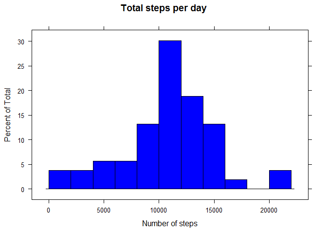
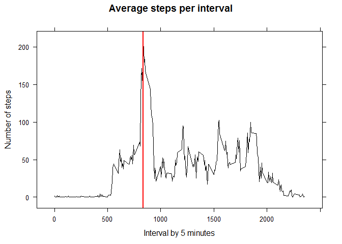
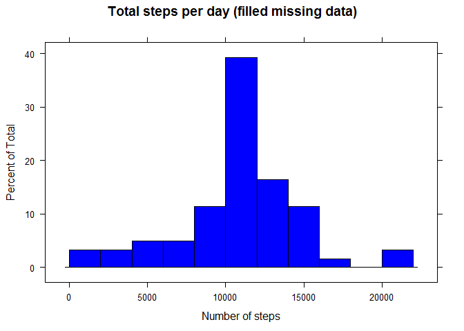
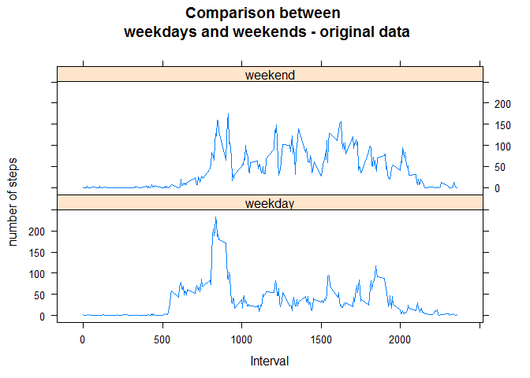
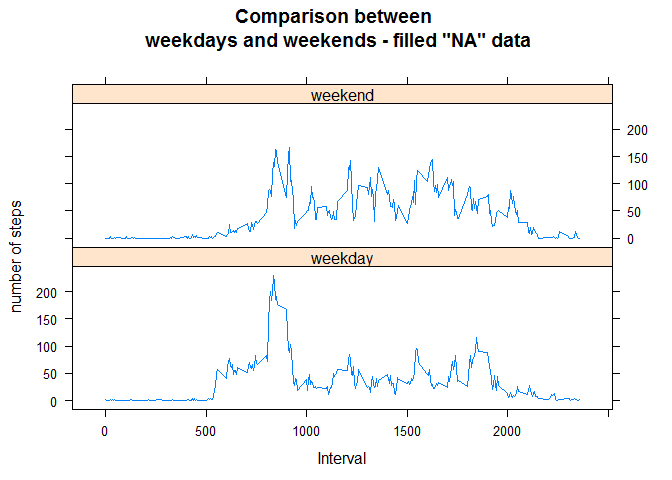

### Setup locale and library, unzipping file

    Sys.setlocale("LC_TIME", "English")

    ## [1] "English_United States.1252"

    library(lattice)
    unzip("activity.zip")

### 1.Code for reading in the dataset and/or processing the data

    file <- read.csv("activity.csv", sep = ",", na.strings = "NA")
    file$date<-as.Date(file$date,"%Y-%m-%d")
    file$steps<- as.numeric(as.character(file$steps))

    sumDay <- aggregate(steps~date,file, sum,na.rm=TRUE)
    avgInterval <- aggregate(steps~interval,file, mean,na.rm=TRUE)

### 2.Histogram of the total number of steps taken each day

    histogram(sumDay$steps, main="Total steps per day", xlab = "Number of steps", breaks = seq(0,22000,by = 2000), col = "Blue" )

### 3.Mean and median number of steps taken each day

    median(sumDay$steps)

    ## [1] 10765

    mean(sumDay$steps)

    ## [1] 10766.19

### 4.Time series plot of the average number of steps taken

    xyplot( steps~interval , data = avgInterval, type="a", col="Black", 
            main="Average steps per interval", xlab = "Interval by 5 minutes", ylab = "Number of steps",
            panel = function(x, y, subscripts, ...) {
               panel.xyplot(x, y,subscripts = subscripts, ...)
               panel.abline(v = avgInterval[ avgInterval$steps == max(avgInterval$steps),"interval"], col="Red", lwd= 2)
               }
           )

### 5.The 5-minute interval that, on average, contains the maximum number of steps

    paste("Interval with maximum average number of steps:",avgInterval[ avgInterval$steps == max(avgInterval$steps),"interval"])

    ## [1] "Interval with maximum average number of steps: 835"

### 6.Code to describe and show a strategy for imputing missing data

    paste("Number of missing steps:", sum(is.na(file$steps)))

    ## [1] "Number of missing steps: 2304"

    paste("Number of missing dates:", sum(is.na(file$date)))

    ## [1] "Number of missing dates: 0"

    paste("Number of missing interval:", sum(is.na(file$interval)))

    ## [1] "Number of missing interval: 0"

    print("I will replace missing steps with the average on the interval across all days")

    ## [1] "I will replace missing steps with the average on the interval across all days"

    fileFilled <- file

    for (i in fileFilled[is.na(fileFilled$steps),"interval"]) 
    {
        fileFilled[is.na(fileFilled$steps) & fileFilled$interval == i,"steps"]<- avgInterval[avgInterval$interval==i,"steps"]
    }

### 7.Histogram of the total number of steps taken each day after missing values are imputed

    sumDayF <- aggregate(steps~date,fileFilled, sum,na.rm=TRUE)
    avgIntervalF <- aggregate(steps~interval,fileFilled, mean,na.rm=TRUE)

    histogram(sumDayF$steps, main="Total steps per day (filled missing data)", xlab = "Number of steps", breaks = seq(0,22000,by = 2000), col = "Blue" )

    median(sumDayF$steps)

    ## [1] 10766.19

    mean(sumDayF$steps)

    ## [1] 10766.19

### 8.Panel plot comparing the average number of steps taken per 5-minute interval across weekdays and weekends

First step, I'll add factor to file and fileFilled data frames, then I
draw the plots

    file$dayType <-factor(sapply(X=weekdays(file$date),FUN = switch,
                                 "Monday" = "weekday", 
                                 "Tuesday" = "weekday", 
                                 "Wednesday" = "weekday", 
                                 "Thursday" = "weekday", 
                                 "Friday" = "weekday", 
                                 "Saturday" = "weekend", 
                                 "Sunday" = "weekend", 
                                 ""))

    fileFilled$dayType <-factor(sapply(X=weekdays(fileFilled$date),FUN = switch,
                                 "Monday" = "weekday", 
                                 "Tuesday" = "weekday", 
                                 "Wednesday" = "weekday", 
                                 "Thursday" = "weekday", 
                                 "Friday" = "weekday", 
                                 "Saturday" = "weekend", 
                                 "Sunday" = "weekend", 
                                 ""))

    avgIntervaldT <- aggregate(steps~interval+dayType,file, mean,na.rm=TRUE)
    avgIntervalFdT<- aggregate(steps~interval+dayType,fileFilled, mean,na.rm=TRUE)

    xyplot( steps ~ interval| dayType ,data = avgIntervaldT, layout=c(1,2), 
            xlab = "Interval", ylab = "number of steps", type="a", 
            main="Comparison between \n weekdays and weekends - original data")

    xyplot( steps ~ interval| dayType ,data = avgIntervalFdT, layout=c(1,2), 
            xlab = "Interval", ylab = "number of steps", type="a",
            main="Comparison between \n weekdays and weekends - filled \"NA\" data")

